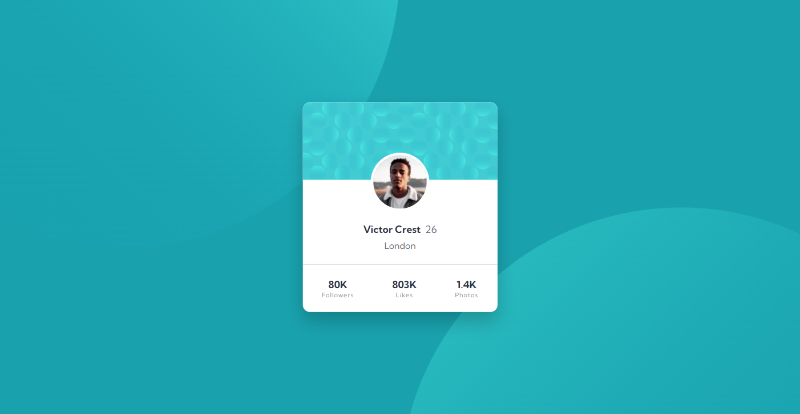

# Frontend Mentor - Profile card component solution

This is a solution to the [Profile card component challenge on Frontend Mentor](https://www.frontendmentor.io/challenges/profile-card-component-cfArpWshJ).

## Table of contents

- [Overview](#overview)
  - [Challenge](#challenge)
  - [Screenshot](#screenshot)
  - [Links](#links)
- [My process](#my-process)
  - [Built with](#built-with)
  - [What I learned](#what-i-learned)
- [Author](#author)

## Overview

### Challenge

Build out the project to the designs provided.

### Screenshot

### Links

- Solution URL: [See the code on GitHub](https://github.com/KristinaRadosavljevic/profile-card-component)
- Live Site URL: [View live site](https://profile-card-component-six-ashen.vercel.app/)

## My process

### Built with

- Semantic HTML5 markup
- CSS/Sass
- Flexbox
- Animations

### What I learned

This was a pretty straightforward challenge as far as the layout was concerned, but I did struggle and experiment a lot with the background image. This gave me an opportunity to practice all the different `background` properties, and I also challenged myself a bit by adding some animations to the background.

In this process, I also discovered the power of using `vmax` and `vmin` units.

## Author

- LinkedIn - [Kristina Radosavljevic](https://www.linkedin.com/in/radosavljevic-kristina/)
- GitHub - [KristinaRadosavljevic](https://github.com/KristinaRadosavljevic)
- Frontend Mentor - [@KristinaRadosavljevic](https://www.frontendmentor.io/profile/KristinaRadosavljevic)
